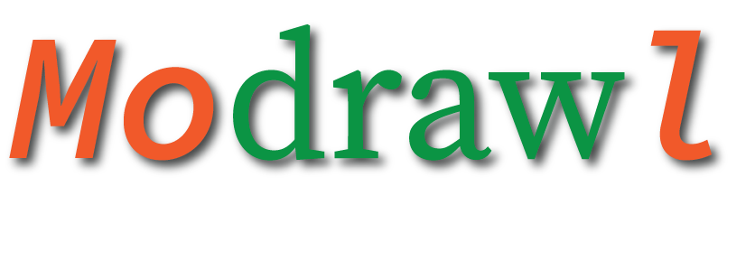
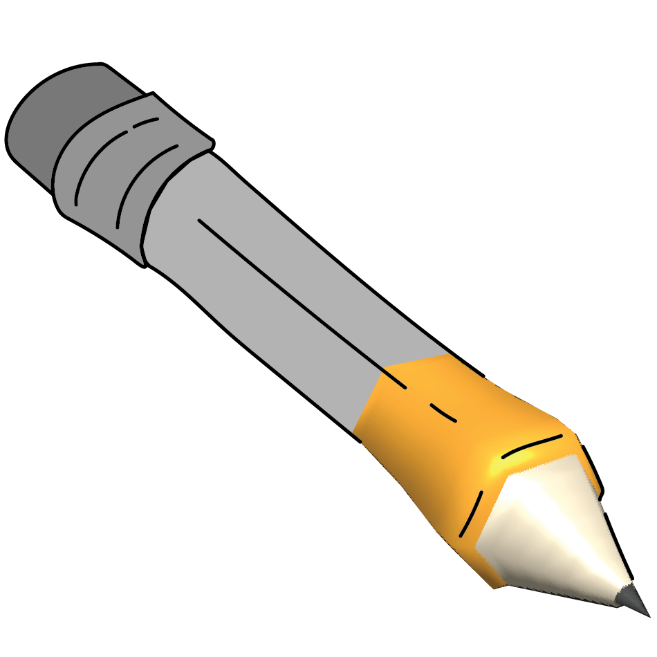

<!-- 

 -->

# Senior Research Project
## "Design and Implementation of Lathe-based and Cross-sectional Organic 3D Modeling and Animation via Sketching and Graphing"

> This project aims to make *organic* 3D modeling and animation more accessible to beginners and 2D-centric artists.

---

## Demos

Figure 1. Parameterized Lathe Model Components (revolved surfaces)

Figure 2. Cross-sectional Model Components (inflated side-views)

Figure 3. Animation of Curves and Parameters

Figure 4. Secondary Cross Sections (animated)

Figure 5: a, b, & c. Exporting Model to OBJ and Applying Modifiers in Outside Programs (Blender Subdivision)

  
  
  

## Other Samples

Figure 6. Gary the Snail

Figure 7. Able-bodied Charmander

Figure 8. Crab Rave v2

Figure 9. A Small Army of Hip-hop Enthusiasts

Figure 10. Porpoise-like Figure Gawking in an Ostentatious Manner

---

### Outside libraries used:
  * **Gui:**              [Dear ImGui](https://github.com/ocornut/imgui) & [imgui_markdown](https://github.com/juliettef/imgui_markdown)
  * **Serialization:**    [Boost](https://www.boost.org/)
  * **OpenGL Rendering:** [GLEW](http://glew.sourceforge.net/) & [GLFW](https://www.glfw.org/)
  * **Math:**             [GLM](https://github.com/g-truc/glm)
  * **Image Loading:**    [stb_image](https://github.com/nothings/stb)

### Font:
[JetBrains Mono](https://www.jetbrains.com/lp/mono/)
